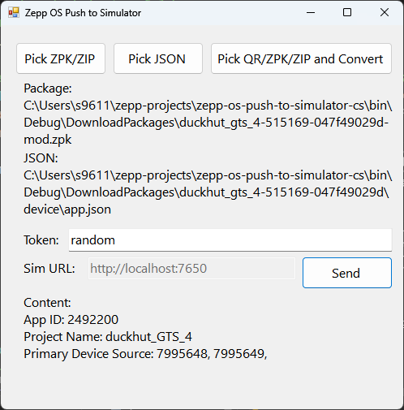
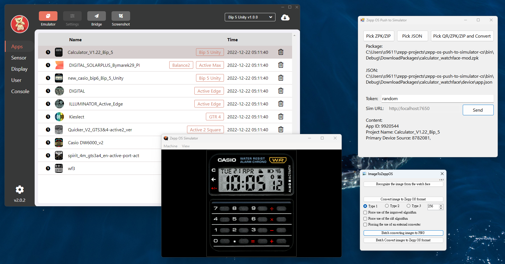

# zepp-os-push-to-simulator-cs
The port of [Bob-YsPan/zepp-os-push-to-simulator](https://github.com/Bob-YsPan/zepp-os-push-to-simulator)

This program uses the same principles and usage methods as the original repository, you can look the original repo to see the usage, and here is some notes:

1. Due to library limitations, the `device.zip` file will be extracted to the `program_path\temp\device` folder. After conversion, it will be automatically moved back to the folder with the same name as the input package.
2. This version eliminates the dependency on Node.js, instead using [socket.io-client-csharp](https://github.com/doghappy/socket.io-client-csharp) and [ZXing.Net](https://github.com/micjahn/ZXing.Net/) to implement communication and QR code parsing.
3. This project requires a minimum of .NET Framework 4.7.2 and is built using Visual Studio 2026.
4. See the [Releases](../../releases) to downloads the pre-built package!
