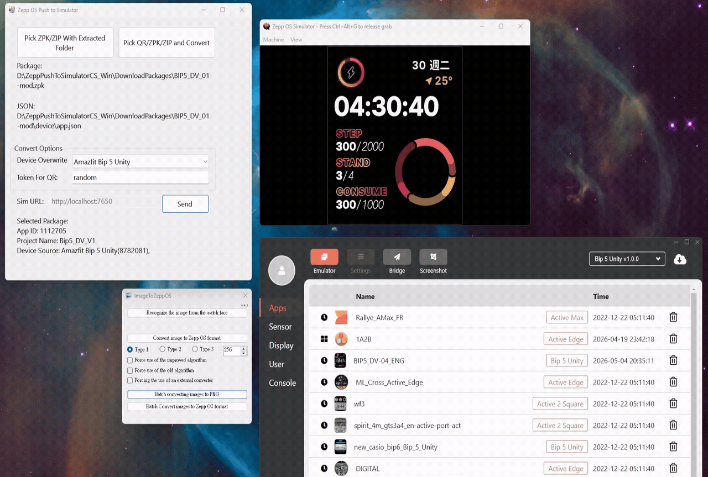
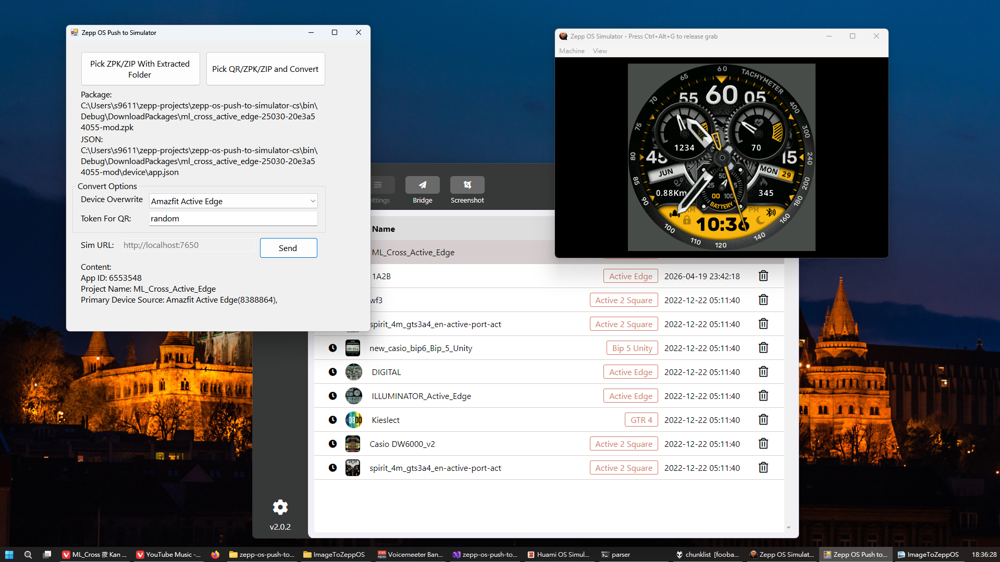
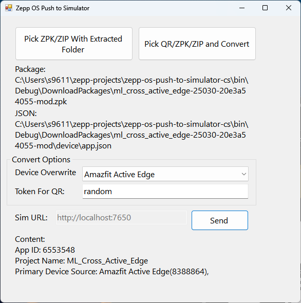

# zepp-os-push-to-simulator-cs
The port of [Bob-YsPan/zepp-os-push-to-simulator](https://github.com/Bob-YsPan/zepp-os-push-to-simulator)

This program uses the same principles and usage methods as the original repository, now is the main tool to help people to convert/upload its zepp package into the simulator!







## Instructions

### Conversion

1. If you are first using this tool, **finished step 2 and 3 first**, and then use the `Pick QR/ZPK/ZIP and Convert` tool to convert the file. This tool can accept these three file types:
    * ZPK file is packed with the official CLI
    * ZIP file for direct download from the Amazfit Watch Faces
    * QR image file (jpg/png) downloaded/generated by CLI/Amazfit Watch Faces site
2. Fill in `Token For QR` if you use the QR code generated by Zeus CLI, or leave `random` if you don't use that way (You can use the Zepp App's QR scanner to scan the URL that replaces `https` with `zpkd1` to the HTTP post tool site to lookups the token)
3. Select the `Device Overwrite` area to overwrite the device source area of the package's json, to ensure the package can run on your simulator.
4. The program will do the zpk file extraction. When it is finished, it will pop up a Message box about the image conversion, and open the explorer of the temp assets' directory. You can convert images using these options:
    * If this package is downloaded from the internet, you can use tools to convert all images back to the correct png using the `ImageToZeppOS` tool made by [SashaCX75](https://amazfitwatchfaces.com/forum/memberlist.php?mode=viewprofile&u=113690) ( [Dropbox](https://www.dropbox.com/s/ugmfqg0xdv8qbcd/ImageToZeppOS.zip?dl=0) ) 
    * If you are testing the project you developed, just replace all PNGs with the project folder's PNG files.
    * All image assets that need to be converted are under the `program_folder\DownloadPackages\temp\device\assets`. The program will open it by explorer automatically.
5. After confirming the message box, the conversion will continue. After conversion is done, you can click the `Connect` and then `Upload` buttom to upload the package into the simulator. 

### Pick Converted file

1. If you already do the conversion, make sure you have a directory structure that **at least includes these files**:
    ```
    your_package.zpk
    your_package/
    |_ device/
        |_ app.json
    ```
    **Notes:**
    1. **You can just extract zpk and then extract inner device.zip to get this structure!**
    2. **`device.zip` needs to use normal PNGs, not the encoded format that is used on an actual watch!**
    2. **`app.json` needs to include the device source that matches your simulator!**
    3. **The converted package and extracted folder that are converted by this tool will be in the `DownloadPackages` folder under the program's folder, and include the `-mod` suffix at the end.**
2. Use the `Pick ZPK/ZIP With Extracted Folder` tool, pick the zpk file (like `your_package.zpk` on step 1) .
3. Check the `Content` area, make sure the package you selected is correct.
4. Click the `Connect` and then `Upload` buttom to upload the package into the simulator. 

## If AOD not working when using simulator
1. Make sure your watch face has an AOD function, and make sure you click the **Padlock icon** to the right of the `RestScreen` block under the `Display` tab.
2. If the AOD does not enter successfully, the simulator screen will not accept any input. Just press `HOME` on the keyboard to escape the AOD status (like if you press the side-button on the watch).
2. Go to the AOD settings on the watch, toggle it to `Off`, and then turn it to `All Day`.
3. Re-test the AOD function.

## Notes

1. Due to library limitations, the `device.zip` file will be extracted to the `program_path\temp\device` folder (Seems easier to do the conversion of the images 😆). After conversion, it will be automatically moved back to the folder with the same name as the input package.
2. Token input is same as the `fakeToken` variable in the downloader.js at the original Node.js version, leave it `random` to auto generates the random token to access the URL from the QR code, or you can fills the real token to access Zepp's server.
3. This version eliminates the dependency on Node.js, instead using [socket.io-client-csharp](https://github.com/doghappy/socket.io-client-csharp) and [ZXing.Net](https://github.com/micjahn/ZXing.Net/) to implement communication and QR code parsing.
4. Supports the zip package that exports by SashaCX75's watchface editor, and the most watchface download from the [Amazfit Watchfaces](https://amazfitwatchfaces.com) just open it by the convert method!
5. This project requires a minimum of .NET Framework 4.7.2 and is built using Visual Studio 2026.
6. See the [Releases](../../releases) to downloads the pre-built package!
